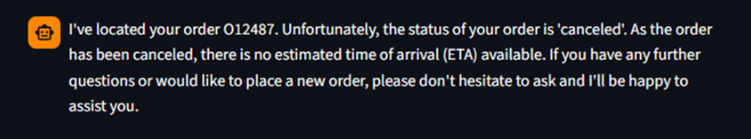
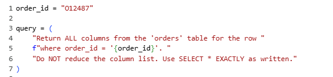
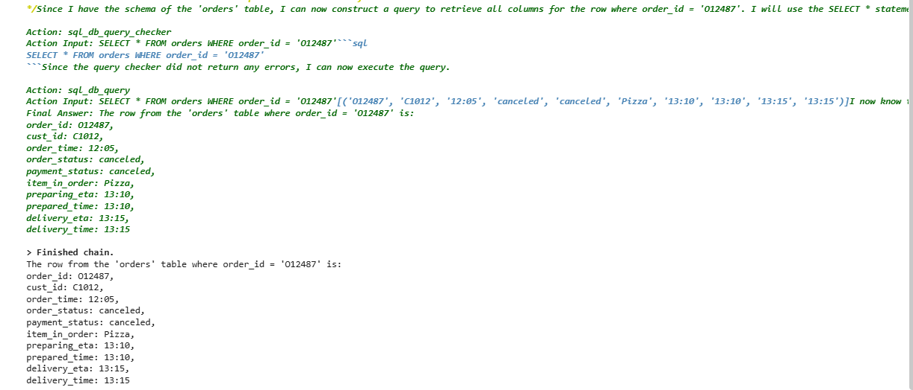

# 🍔 FoodHub - Food Delivery Chatbot
## 📌 Project Description
FoodHub is an intelligent food delivery chatbot that allows users to browse menus, place orders, and interact using natural language. The system integrates a database to manage food items and orders efficiently.

---

## ✨ Features
- Conversational food ordering system  
- Menu browsing through chatbot  
- Order placement and tracking  
- Database integration for storing orders  
- User-friendly interaction

---

## 📸 Screenshots

### 💬 Chat Input


### 🤖 Chatbot Response


### 🧾 Order Confirmation


### 🗄️ Database Query



---

## 🛠️ Tech Stack
- Python  
- Pandas, NumPy  
- SQLite (via sqlite3 with SQL queries)  
- LangChain (for chatbot workflow)  
- ChatGroq (LLM) integrated using LangChain 

---

## 📊 Project Workflow
1. Import and initialize required libraries  
2. Configure Large Language Model (LLM)  
3. Connect chatbot with SQL database  
4. Build conversational flow using LangChain  
5. Process user queries and return responses  

---

## 📈 Output
The chatbot successfully interprets user queries and provides relevant responses such as menu suggestions, order confirmation, and tracking details.

---

## ⚙️ Installation & Setup
```bash
git clone https://github.com/nayanasharma7124/FoodHub
cd FoodHub
pip install -r requirements.txt
python app.py
